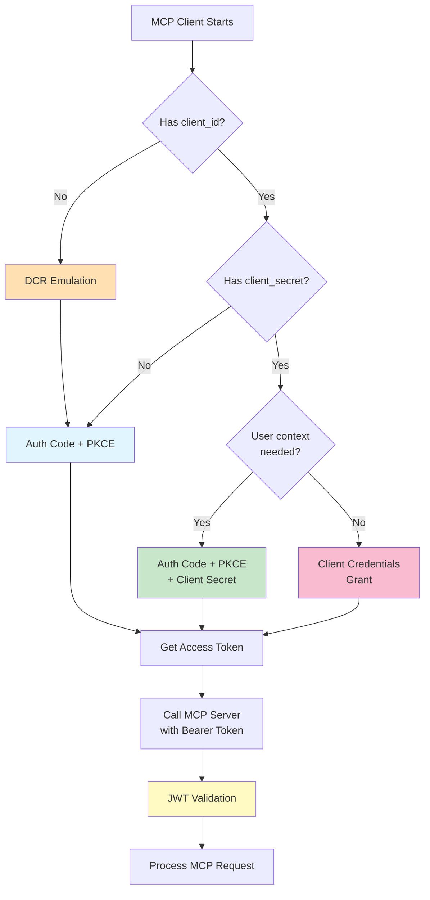

# Complete System Overview

This document provides a high-level overview of the entire MCP authentication system, showing how all the components and flows work together.

## System Architecture Diagram

```mermaid
graph TB
    subgraph "MCP Clients"
        VSCode[VS Code<br/>Public Client]
        Claude[Claude Desktop<br/>Public Client]
        ClaudeCode[Claude Code<br/>Public Client]
        ChatGPT[ChatGPT<br/>Public Client]
        Confidential[Confidential Client<br/>Web App]
        ServicePrincipal[Service Principal<br/>Automated Service]
    end

    subgraph "MCP Server (FastAPI)"
        DCR[DCR Emulation<br/>Client Detection]
        Auth[Authentication<br/>Middleware]
        JWT[JWT Validator<br/>Comprehensive Checks]
        JWKS[JWKS Cache<br/>24h TTL]
        MCP[MCP Protocol<br/>Implementation]
    end

    subgraph "Entra ID (Azure AD)"
        OIDC[OIDC Endpoints<br/>/.well-known/...]
        TokenEndpoint[Token Endpoint<br/>/token]
        AuthzEndpoint[Authorization Endpoint<br/>/authorize]
        JWKSEndpoint[JWKS Endpoint<br/>/keys]
        Apps[App Registrations<br/>8 apps total]
    end

    subgraph "Token Types"
        UserToken[User Token<br/>scp claim]
        AppToken[App-Only Token<br/>roles claim]
    end

    %% DCR Flow
    VSCode -->|"1. No credentials"| DCR
    Claude -->|"1. No credentials"| DCR
    ClaudeCode -->|"1. No credentials"| DCR
    ChatGPT -->|"1. No credentials"| DCR
    DCR -->|"2. Return client_id"| VSCode
    DCR -->|"2. Return client_id"| Claude
    DCR -->|"2. Return client_id"| ClaudeCode
    DCR -->|"2. Return client_id"| ChatGPT

    %% OAuth Flow - Public Clients
    VSCode -->|"3. Auth Code + PKCE"| AuthzEndpoint
    Claude -->|"3. Auth Code + PKCE"| AuthzEndpoint
    ClaudeCode -->|"3. Auth Code + PKCE"| AuthzEndpoint
    ChatGPT -->|"3. Auth Code + PKCE"| AuthzEndpoint
    AuthzEndpoint -->|"4. Auth code"| VSCode
    AuthzEndpoint -->|"4. Auth code"| Claude
    AuthzEndpoint -->|"4. Auth code"| ClaudeCode
    AuthzEndpoint -->|"4. Auth code"| ChatGPT
    VSCode -->|"5. Exchange code"| TokenEndpoint
    Claude -->|"5. Exchange code"| TokenEndpoint
    ClaudeCode -->|"5. Exchange code"| TokenEndpoint
    ChatGPT -->|"5. Exchange code"| TokenEndpoint
    TokenEndpoint -->|"6. Access token"| VSCode
    TokenEndpoint -->|"6. Access token"| Claude
    TokenEndpoint -->|"6. Access token"| ClaudeCode
    TokenEndpoint -->|"6. Access token"| ChatGPT

    %% OAuth Flow - Confidential Client
    Confidential -->|"Auth Code + PKCE<br/>+ client_secret"| AuthzEndpoint
    AuthzEndpoint -->|"Auth code"| Confidential
    Confidential -->|"Exchange code<br/>+ client_secret"| TokenEndpoint
    TokenEndpoint -->|"Access token"| Confidential

    %% Client Credentials Flow - Service Principal
    ServicePrincipal -->|"Client Credentials<br/>Grant"| TokenEndpoint
    TokenEndpoint -->|"Access token"| ServicePrincipal

    %% Token classification
    TokenEndpoint -.->|"User context"| UserToken
    TokenEndpoint -.->|"App context"| AppToken

    %% MCP Requests
    VSCode -->|"7. MCP request<br/>+ Bearer token"| Auth
    Claude -->|"7. MCP request<br/>+ Bearer token"| Auth
    ClaudeCode -->|"7. MCP request<br/>+ Bearer token"| Auth
    ChatGPT -->|"7. MCP request<br/>+ Bearer token"| Auth
    Confidential -->|"MCP request<br/>+ Bearer token"| Auth
    ServicePrincipal -->|"MCP request<br/>+ Bearer token"| Auth

    %% JWT Validation
    Auth -->|"8. Validate JWT"| JWT
    JWT -->|"9. Get JWKS"| JWKS
    JWKS -->|"Cache miss"| JWKSEndpoint
    JWKSEndpoint -->|"Public keys"| JWKS
    JWKS -->|"Cached keys"| JWT

    %% Token Type Detection
    JWT -->|"Check idtyp, scp, roles"| UserToken
    JWT -->|"Check idtyp, scp, roles"| AppToken
    UserToken -->|"Validate scp claim"| JWT
    AppToken -->|"Validate roles claim"| JWT

    %% MCP Processing
    JWT -->|"10. Valid token"| MCP
    MCP -->|"11. MCP response"| Auth
    Auth -->|"12. Response"| VSCode
    Auth -->|"12. Response"| Claude
    Auth -->|"12. Response"| ClaudeCode
    Auth -->|"12. Response"| ChatGPT
    Auth -->|"12. Response"| Confidential
    Auth -->|"12. Response"| ServicePrincipal

    %% Discovery
    JWT -->|"Discover OIDC config"| OIDC
    OIDC -.->|"Endpoints"| JWT

    %% Styling
    classDef clientStyle fill:#e1f5ff,stroke:#01579b,stroke-width:2px
    classDef serverStyle fill:#fff3e0,stroke:#e65100,stroke-width:2px
    classDef entraStyle fill:#e8f5e9,stroke:#1b5e20,stroke-width:2px
    classDef tokenStyle fill:#f3e5f5,stroke:#4a148c,stroke-width:2px

    class VSCode,Claude,ClaudeCode,ChatGPT,Confidential,ServicePrincipal clientStyle
    class DCR,Auth,JWT,JWKS,MCP serverStyle
    class OIDC,TokenEndpoint,AuthzEndpoint,JWKSEndpoint,Apps entraStyle
    class UserToken,AppToken tokenStyle
```



## Flow Summary

### 1. DCR Emulation (for clients without credentials)

```text
MCP Client → MCP Server DCR Endpoint
↓ (analyzes redirect_uri, User-Agent, etc.)
MCP Server → Returns appropriate client_id
↓
MCP Client now has client_id → Proceeds to OAuth flow
```

### 2. Authorization Code + PKCE (Public/Confidential Clients)

```text
MCP Client → Entra ID Authorization Endpoint (with PKCE challenge)
↓
User signs in and consents
↓
Entra ID → Redirect to client with auth code
↓
MCP Client → Entra ID Token Endpoint (with code_verifier)
↓
Entra ID → Returns access token (+ ID token)
↓
MCP Client → MCP Server (with Bearer token)
```

### 3. Client Credentials Grant (Service Principals)

```text
Service Principal → Entra ID Token Endpoint (with client_secret)
↓
Entra ID validates credentials
↓
Entra ID → Returns access token (app-only)
↓
Service Principal → MCP Server (with Bearer token)
```

### 4. JWT Validation (MCP Server)

```text
MCP Server receives request with Bearer token
↓
Extract JWT from Authorization header
↓
Parse header and payload (3-part structure check)
↓
Get JWKS (from cache or Entra ID)
↓
Verify signature with public key (RS256)
↓
Validate temporal claims (exp, nbf, iat)
↓
Validate issuer, audience, tenant
↓
Detect token type (user vs app-only)
├─ User token: validate scp claim
└─ App-only token: validate roles claim
↓
Extract identity (user or service principal)
↓
Process MCP request
```

## Authentication Flow Decision Tree



## Token Claim Comparison

### User Token (Delegated Permissions)

```json
{
  "aud": "api://mcp-server",
  "iss": "https://login.microsoftonline.com/{tenant}/v2.0",
  "iat": 1234567890,
  "nbf": 1234567890,
  "exp": 1234571490,
  "scp": "mcp.read mcp.write",           ← User scopes
  "oid": "user-object-id",                ← User identity
  "sub": "user-subject-id",
  "preferred_username": "user@example.com",
  "appid": "client-app-id",               ← Client identity
  "tid": "tenant-id",
  "ver": "2.0"
}
```

### App-Only Token (Application Permissions)

```json
{
  "aud": "api://mcp-server",
  "iss": "https://login.microsoftonline.com/{tenant}/v2.0",
  "iat": 1234567890,
  "nbf": 1234567890,
  "exp": 1234571490,
  "roles": ["MCP.ReadWrite.All"],         ← App roles
  "idtyp": "app",                         ← Token type indicator
  "oid": "sp-object-id",                  ← Service principal identity
  "sub": "sp-object-id",
  "appid": "client-app-id",
  "tid": "tenant-id",
  "ver": "2.0"
}
```

**Key Difference**: `scp` vs `roles` claim!

## Entra ID App Registrations

### Resource (1 app)

- **mcp-server-resource** (`api://mcp-server`)
  - Exposes scopes: `mcp.read`, `mcp.write`
  - Defines roles: `MCP.Read.All`, `MCP.ReadWrite.All`

### Public Clients (5 apps)

- **vscode-mcp-client** - VS Code integration
- **claude-desktop-mcp-client** - Claude Desktop
- **claude-code-mcp-client** - Claude Code CLI
- **chatgpt-mcp-client** - ChatGPT integration
- **generic-mcp-client** - Fallback for unknown clients

### Confidential Client (1 app)

- **confidential-mcp-client** - Has client_secret

### Service Principal (1 app)

- **service-mcp-client** - For Client Credentials flow

**Total: 8 app registrations**

## Security Layers

```text
┌─────────────────────────────────────────────┐
│  Layer 1: Client Authentication             │
│  ├─ Public: PKCE                            │
│  ├─ Confidential: Client Secret + PKCE      │
│  └─ Service Principal: Client Secret        │
└─────────────────────────────────────────────┘
                    ↓
┌─────────────────────────────────────────────┐
│  Layer 2: User Authentication (if needed)   │
│  └─ Entra ID login + MFA (optional)         │
└─────────────────────────────────────────────┘
                    ↓
┌─────────────────────────────────────────────┐
│  Layer 3: Token Issuance                    │
│  └─ Entra ID issues signed JWT              │
└─────────────────────────────────────────────┘
                    ↓
┌─────────────────────────────────────────────┐
│  Layer 4: JWT Signature Verification        │
│  └─ Verify with JWKS public key             │
└─────────────────────────────────────────────┘
                    ↓
┌─────────────────────────────────────────────┐
│  Layer 5: JWT Claims Validation             │
│  ├─ Temporal: exp, nbf, iat                 │
│  ├─ Issuer: iss, tid                        │
│  ├─ Audience: aud                           │
│  └─ Version: ver                            │
└─────────────────────────────────────────────┘
                    ↓
┌─────────────────────────────────────────────┐
│  Layer 6: Permission Validation             │
│  ├─ User tokens: scp claim                  │
│  └─ App-only tokens: roles claim            │
└─────────────────────────────────────────────┘
                    ↓
┌─────────────────────────────────────────────┐
│  Layer 7: Identity Extraction               │
│  └─ User: oid, sub, preferred_username      │
│  └─ App: appid, oid                         │
└─────────────────────────────────────────────┘
                    ↓
┌─────────────────────────────────────────────┐
│  Layer 8: MCP Request Processing            │
│  └─ Execute MCP tools/resources             │
└─────────────────────────────────────────────┘
```

## Deployment Modes

### Fargate Mode

```text
Internet → ALB → ECS Fargate (MCP Server) → Entra ID
                      ↓
                  CloudWatch
                      ↓
                   X-Ray
```

### Agent Core Mode

```text
Internet → CloudFront → Agent Core → MCP Server → Entra ID
           (URL rewrite)  (Auth proxy)
```

## Client Detection Logic (DCR Emulation)

```python
# Pseudocode for client detection
def detect_client_type(request):
    redirect_uri = request.body.get("redirect_uri")
    user_agent = request.headers.get("User-Agent")

    if "vscode://" in redirect_uri:
        return "vscode"
    elif "claude://" in redirect_uri and "desktop" in user_agent.lower():
        return "claude-desktop"
    elif "localhost" in redirect_uri and "claude" in user_agent.lower():
        return "claude-code"
    elif "chatgpt" in user_agent.lower() or "openai" in redirect_uri:
        return "chatgpt"
    else:
        return "generic"

def get_client_id(client_type):
    mapping = {
        "vscode": os.getenv("VSCODE_CLIENT_ID"),
        "claude-desktop": os.getenv("CLAUDE_DESKTOP_CLIENT_ID"),
        "claude-code": os.getenv("CLAUDE_CODE_CLIENT_ID"),
        "chatgpt": os.getenv("CHATGPT_CLIENT_ID"),
        "generic": os.getenv("GENERIC_CLIENT_ID")
    }
    return mapping.get(client_type)
```

## Key Takeaways

1. **No Token Minting**: All tokens issued by Entra ID, never by MCP server
2. **Comprehensive Validation**: 8 layers of security checks
3. **Flexible Authentication**: Supports 4 different OAuth flows
4. **Smart DCR**: Emulates DCR by detecting client type
5. **Enterprise Ready**: Proper JWT validation, JWKS caching, multi-tenant support
6. **Defense in Depth**: Multiple layers of authentication and authorization

## Next Steps

For detailed flows, see:

1. [DCR Emulation Flow](./01-dcr-emulation-flow.md)
2. [Public Client Auth Flow](./02-public-client-auth-flow.md)
3. [Confidential Client Auth Flow](./03-confidential-client-auth-flow.md)
4. [Service Principal Client Credentials Flow](./04-service-principal-client-credentials-flow.md)
5. [JWT Validation Flow](./05-jwt-validation-flow.md)
