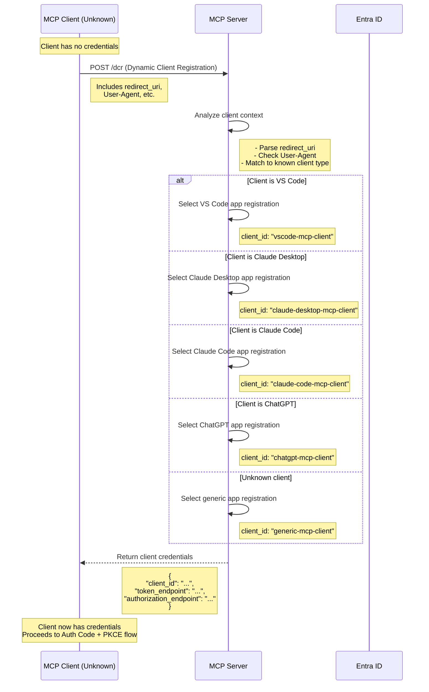

# DCR Emulation Flow

Since Entra ID doesn't support native Dynamic Client Registration (DCR), the MCP server emulates this by detecting the client type and returning pre-registered client credentials.

## Key Points

1. **Client Detection Logic**:
   - `redirect_uri` patterns (e.g., `vscode://`, `claude://`, custom URIs)
   - User-Agent strings
   - Custom headers or metadata in DCR request

2. **Pre-registered App Registrations in Entra ID**:
   - `vscode-mcp-client` - VS Code MCP client
   - `claude-desktop-mcp-client` - Claude Desktop
   - `claude-code-mcp-client` - Claude Code CLI
   - `chatgpt-mcp-client` - ChatGPT integration
   - `generic-mcp-client` - Fallback for unknown clients
   - `mcp-server-resource` - The MCP server as a protected resource

3. **Security Considerations**:
   - DCR endpoint should be rate-limited
   - Client detection should be robust against spoofing
   - Each app registration has specific redirect_uri whitelist in Entra ID
   - MCP server validates that returned client_id matches the detected client type
