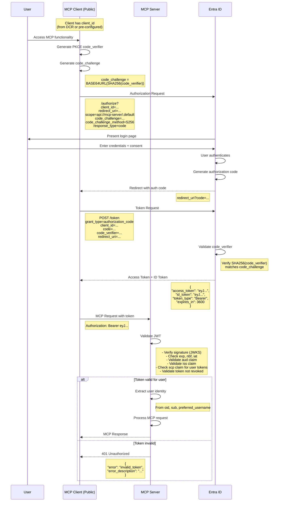

# Public Client Authentication Flow (Auth Code + PKCE)

This flow is used for public clients
(both those that obtained client_id via DCR and those that already have one).

> **Optional Discovery Step**: Before initiating this flow,
> clients can optionally discover the authorization server and required scopes
> via Protected Resource Metadata.
> See [06-protected-resource-metadata.md](./06-protected-resource-metadata.md).

## Key Points

1. **PKCE (Proof Key for Code Exchange)**:
   - Protects against authorization code interception attacks
   - Required for public clients (per OAuth 2.1)
   - Code verifier: 43-128 character random string
   - Code challenge: Base64URL(SHA256(code_verifier))

2. **Scope**:
   - `api://mcp-server/.default` requests default scopes for the MCP server resource
   - Can be customized to specific scopes like `api://mcp-server/mcp.read`, `api://mcp-server/mcp.write`

3. **JWT Validation** (detailed in separate diagram):
   - Signature validation using JWKS from Entra ID
   - Temporal validation (exp, nbf, iat)
   - Audience validation (aud must match MCP server app ID)
   - Issuer validation (iss must match Entra ID tenant)
   - Scope validation (scp claim for user tokens)
   - Optional: Check for token revocation

4. **User Identity**:
   - `oid` - Object ID (unique identifier)
   - `sub` - Subject (stable identifier)
   - `preferred_username` - User's email/UPN
   - `name` - Display name
