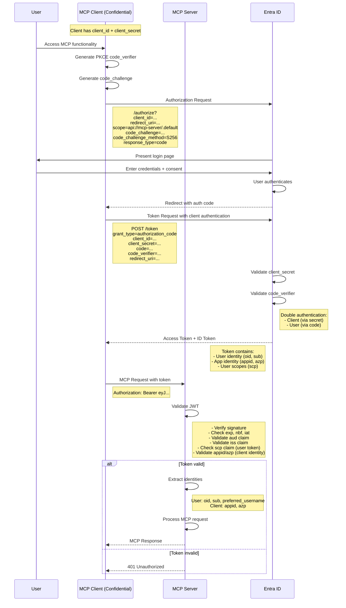

# Confidential Client Authentication Flow (Auth Code + PKCE + Client Secret)

This flow is used for confidential clients that have both client_id and client_secret. Still uses Auth Code flow for user context, but authenticates the client itself.

## Key Points

1. **Client Authentication**:
   - Confidential clients authenticate with `client_secret`
   - This is in addition to the authorization code flow
   - Provides stronger assurance of client identity

2. **Still Uses PKCE**:
   - Even confidential clients should use PKCE (defense in depth)
   - Protects against additional attack vectors
   - Recommended by OAuth 2.1 for all client types

3. **Token Contains Both Identities**:
   - **User identity**: `oid`, `sub`, `preferred_username`, `name`
   - **Client identity**: `appid`, `azp` (authorized party)
   - Allows server to track both who the user is and which client is acting

4. **JWT Claims Validation**:
   - `scp` claim indicates this is a delegated permission (user token)
   - `appid`/`azp` shows which client app is being used
   - Can implement client-specific policies based on `appid`

5. **Use Cases**:
   - Server-side web applications
   - Backend services acting on behalf of users
   - Scenarios requiring stronger client authentication
