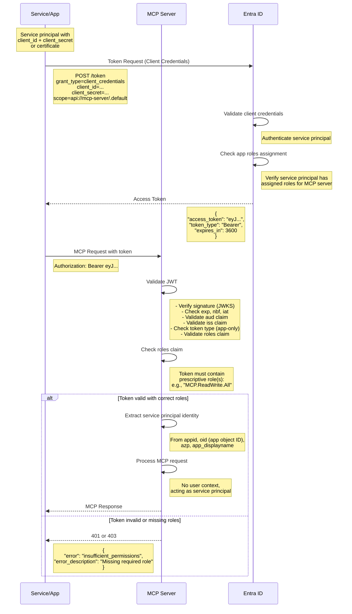

# Service Principal Flow (Client Credentials Grant)

This flow is for machine-to-machine scenarios where a service principal authenticates without user context.



## Key Points

1. **No User Context**:
   - Client Credentials flow is machine-to-machine
   - No user signs in, no consent screen
   - Token represents the service principal itself

2. **Token Claim Differences**:
   - **User tokens** have `scp` (delegated scopes)
   - **App-only tokens** have `roles` (application permissions)
   - Must validate the correct claim based on token type

3. **Role-Based Access Control**:
   - Service principal must be assigned app roles in Entra ID
   - Example roles for MCP server:
     - `MCP.Read.All` - Read-only access
     - `MCP.ReadWrite.All` - Full access
     - `MCP.Execute.All` - Execute MCP functions
   - MCP server validates token contains required role(s)

4. **JWT Validation Specifics**:
   - `idtyp` claim should be "app" (app-only token)
   - No `scp` claim (should validate absence for app-only)
   - `roles` claim contains array of assigned roles
   - `oid` is the object ID of the service principal (not a user)
   - `sub` equals `oid` for app-only tokens

5. **Authentication Methods**:
   - **Client Secret**: Shared secret (shown in diagram)
   - **Certificate**: More secure, X.509 certificate-based auth
   - **Federated Identity Credential**: For Azure resources (managed identity)

6. **Use Cases**:
   - Automated scripts/jobs
   - Backend services without user interaction
   - System integration scenarios
   - Batch processing

## Example Token Claims (App-Only)

```json
{
  "aud": "api://mcp-server",
  "iss": "https://login.microsoftonline.com/{tenant-id}/v2.0",
  "iat": 1234567890,
  "nbf": 1234567890,
  "exp": 1234571490,
  "aio": "...",
  "appid": "12345678-1234-1234-1234-123456789abc",
  "appidacr": "1",
  "idp": "https://sts.windows.net/{tenant-id}/",
  "idtyp": "app",
  "oid": "87654321-4321-4321-4321-cba987654321",
  "rh": "...",
  "roles": [
    "MCP.ReadWrite.All"
  ],
  "sub": "87654321-4321-4321-4321-cba987654321",
  "tid": "{tenant-id}",
  "uti": "...",
  "ver": "2.0"
}
```

Note the presence of `roles` and absence of `scp`, and `idtyp: "app"`.
