# JWT Validation Flow (Comprehensive Security Checks)

This diagram details the complete JWT validation process that the MCP server performs for every incoming token.

```mermaid
sequenceDiagram
    participant MCP Client
    participant MCP Server
    participant Entra ID JWKS
    participant Cache

    MCP Client->>MCP Server: Request with JWT
    Note right of MCP Client: Authorization: Bearer eyJ...

    MCP Server->>MCP Server: Extract JWT from header

    rect rgb(240, 240, 255)
        Note right of MCP Server: STEP 1: Parse & Decode
        MCP Server->>MCP Server: Decode JWT (header + payload)
        MCP Server->>MCP Server: Verify JWT structure
        Note right of MCP Server: Must have 3 parts:<br/>header.payload.signature
    end

    rect rgb(255, 240, 240)
        Note right of MCP Server: STEP 2: Signature Verification
        MCP Server->>MCP Server: Extract 'kid' from header

        MCP Server->>Cache: Check JWKS cache
        alt JWKS in cache and not expired
            Cache-->>MCP Server: Return cached JWKS
        else JWKS not in cache or expired
            MCP Server->>Entra ID JWKS: GET /.well-known/openid-configuration
            Entra ID JWKS-->>MCP Server: OIDC metadata

            MCP Server->>Entra ID JWKS: GET /discovery/v2.0/keys
            Entra ID JWKS-->>MCP Server: JWKS (public keys)

            MCP Server->>Cache: Store JWKS (TTL: 24h)
        end

        MCP Server->>MCP Server: Find key matching 'kid'
        MCP Server->>MCP Server: Verify signature with public key
        Note right of MCP Server: RS256 signature validation
    end

    rect rgb(240, 255, 240)
        Note right of MCP Server: STEP 3: Temporal Validation
        MCP Server->>MCP Server: Get current timestamp

        MCP Server->>MCP Server: Check 'exp' (expiration)
        Note right of MCP Server: exp > now<br/>(with clock skew tolerance)

        MCP Server->>MCP Server: Check 'nbf' (not before)
        Note right of MCP Server: nbf <= now<br/>(with clock skew tolerance)

        MCP Server->>MCP Server: Check 'iat' (issued at)
        Note right of MCP Server: Ensure token not too old
    end

    rect rgb(255, 255, 240)
        Note right of MCP Server: STEP 4: Claim Validation

        MCP Server->>MCP Server: Validate 'iss' (issuer)
        Note right of MCP Server: Must match:<br/>https://login.microsoftonline.com/{tenant}/v2.0<br/>or https://sts.windows.net/{tenant}/

        MCP Server->>MCP Server: Validate 'aud' (audience)
        Note right of MCP Server: Must match MCP server app ID<br/>or api://mcp-server

        MCP Server->>MCP Server: Validate 'tid' (tenant)
        Note right of MCP Server: Must match allowed tenant(s)

        MCP Server->>MCP Server: Check token version
        Note right of MCP Server: 'ver' should be "2.0"
    end

    rect rgb(255, 240, 255)
        Note right of MCP Server: STEP 5: Token Type Detection

        MCP Server->>MCP Server: Check 'idtyp' claim

        alt idtyp == "app" OR scp is absent
            Note right of MCP Server: App-only token (service principal)

            MCP Server->>MCP Server: Validate 'roles' claim exists
            MCP Server->>MCP Server: Check for required role
            Note right of MCP Server: e.g., "MCP.ReadWrite.All"

            MCP Server->>MCP Server: Extract service principal identity
            Note right of MCP Server: appid, oid, sub

        else scp exists
            Note right of MCP Server: User token (delegated)

            MCP Server->>MCP Server: Validate 'scp' claim
            Note right of MCP Server: Check for required scope<br/>e.g., "mcp.read mcp.write"

            MCP Server->>MCP Server: Extract user identity
            Note right of MCP Server: oid, sub, preferred_username

            MCP Server->>MCP Server: Extract client identity (optional)
            Note right of MCP Server: appid, azp
        end
    end

    rect rgb(240, 255, 255)
        Note right of MCP Server: STEP 6: Additional Security Checks

        MCP Server->>MCP Server: Check 'acr' (auth context)
        Note right of MCP Server: Validate MFA if required

        MCP Server->>MCP Server: Check 'amr' (auth methods)
        Note right of MCP Server: Validate auth method requirements

        opt Token Revocation Check (Optional)
        MCP Server->>Cache: Check revocation cache
        alt Token in revocation list
            MCP Server->>MCP Server: Reject token
        end
        end

        MCP Server->>MCP Server: Validate 'nonce' if present
        Note right of MCP Server: For ID tokens in hybrid flows
    end

    alt All validations pass
        MCP Server->>MCP Server: Token valid
        MCP Server->>MCP Server: Process request
        MCP Server-->>MCP Client: Success response
    else Any validation fails
        MCP Server->>MCP Server: Token invalid
        MCP Server-->>MCP Client: 401 Unauthorized
        Note left of MCP Server: {<br/>  "error": "invalid_token",<br/>  "error_description": "specific reason"<br/>}
    end
```



## Validation Checklist

### 1. Structure and Format

- [ ] JWT has three parts (header.payload.signature)
- [ ] Base64URL decoding successful
- [ ] JSON parsing successful

### 2. Signature Verification

- [ ] JWKS retrieved and cached
- [ ] Matching key found by `kid`
- [ ] RS256 signature verified with public key
- [ ] Signature is valid and not tampered

### 3. Temporal Claims

- [ ] `exp` (expiration) > current time (with 5-min skew)
- [ ] `nbf` (not before) <= current time (with 5-min skew)
- [ ] `iat` (issued at) is reasonable (not too old, not in future)

### 4. Required Claims

- [ ] `iss` (issuer) matches expected Entra ID endpoint
- [ ] `aud` (audience) matches MCP server app ID
- [ ] `tid` (tenant ID) matches allowed tenant(s)
- [ ] `ver` (version) is "2.0" (AAD v2.0 tokens)

### 5. Token Type and Permissions

**For User Tokens (delegated):**

- [ ] `scp` claim present with required scopes
- [ ] `oid` present (user object ID)
- [ ] `sub` present (user subject)

**For App-Only Tokens (service principal):**

- [ ] `idtyp` is "app" OR `scp` absent
- [ ] `roles` claim present with required roles
- [ ] `appid` present (application ID)
- [ ] `sub` equals `oid` (for app-only)

### 6. Security Best Practices

- [ ] Token not in revocation list (if applicable)
- [ ] `acr` (auth context class) meets requirements (e.g., MFA)
- [ ] `amr` (auth methods reference) acceptable
- [ ] No suspicious claims or values
- [ ] Tenant isolation enforced (if multi-tenant)

## Python Implementation Notes

### Recommended Library: `python-jose[cryptography]`

```python
from jose import jwt, jwk, JWTError
from jose.exceptions import JWTClaimsError, ExpiredSignatureError
import requests
from datetime import datetime, timedelta
from typing import Dict, Optional
import os

class JWTValidator:
    def __init__(self):
        self.tenant_id = os.getenv("ENTRA_TENANT_ID")
        self.audience = os.getenv("MCP_SERVER_APP_ID")
        self.issuer = f"https://login.microsoftonline.com/{self.tenant_id}/v2.0"
        self.jwks_uri = f"https://login.microsoftonline.com/{self.tenant_id}/discovery/v2.0/keys"
        self.jwks_cache = None
        self.jwks_cache_expiry = None

    async def validate_token(self, token: str) -> Dict:
        """
        Comprehensive JWT validation
        Returns: decoded claims if valid
        Raises: JWTError if invalid
        """
        # Get JWKS
        jwks = await self._get_jwks()

        # Decode and validate
        try:
            claims = jwt.decode(
                token,
                jwks,
                algorithms=["RS256"],
                audience=self.audience,
                issuer=self.issuer,
                options={
                    "verify_signature": True,
                    "verify_exp": True,
                    "verify_nbf": True,
                    "verify_iat": True,
                    "verify_aud": True,
                    "verify_iss": True,
                    "require_exp": True,
                    "require_iat": True,
                    "leeway": 300  # 5 minutes clock skew tolerance
                }
            )
        except ExpiredSignatureError:
            raise JWTError("Token has expired")
        except JWTClaimsError as e:
            raise JWTError(f"Invalid claims: {str(e)}")

        # Additional validation
        self._validate_tenant(claims)
        self._validate_token_type(claims)

        return claims
```

### Alternative: `authlib`

```python
from authlib.jose import jwt, JoseError
from authlib.jose.rfc7517 import JsonWebKey

# Similar validation with authlib
# More RFC-compliant, excellent for advanced use cases
```

### Alternative: `PyJWT`

```python
import jwt
from cryptography.hazmat.primitives import serialization

# Lower-level, more manual validation
# Good for custom requirements
```

**Recommendation**: Use `python-jose` for this project - good balance of features and ease of use.

## Clock Skew Tolerance

- Allow 5 minutes of clock skew for `exp`, `nbf`, and `iat` validation
- Prevents issues with time sync between servers
- Standard practice in JWT validation

## JWKS Caching Strategy

1. **Cache Duration**: 24 hours
2. **Refresh on kid mismatch**: If token has unknown `kid`, refresh JWKS
3. **Error handling**: If JWKS fetch fails, use cached version if available
4. **Concurrent requests**: Use async/await to prevent JWKS fetch stampede

## Token Revocation

Optional but recommended for high-security scenarios:

1. **Session revocation cache** (Redis/Memcached)
2. **Check on critical operations** (not every request for performance)
3. **TTL matches token expiration**

For this demo, we'll implement basic revocation support that can be enabled via config.
