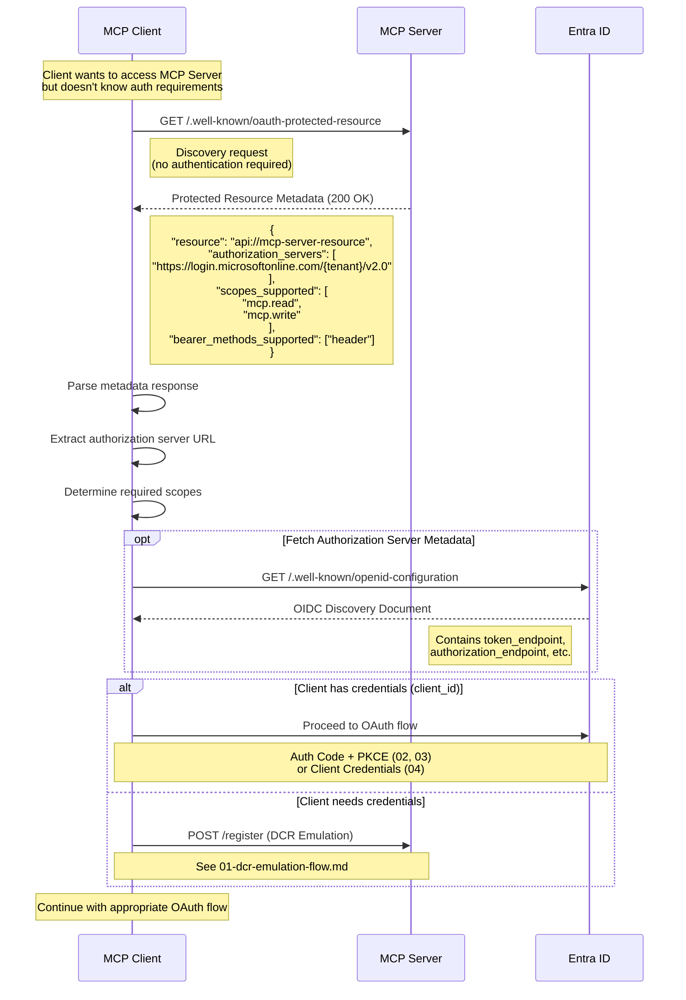

# Protected Resource Metadata Discovery

OAuth 2.0 Protected Resource Metadata (RFC 9728) allows MCP clients to discover
the authorization requirements for an MCP server before initiating an OAuth flow.
This is an optional but recommended discovery step that enables dynamic configuration.

## What is Protected Resource Metadata?

Protected Resource Metadata is a standardized way for a protected resource (the MCP server)
to advertise its OAuth requirements at a well-known endpoint.
Clients can fetch this metadata to learn:

- Which authorization server(s) issue valid tokens
- What scopes are available
- How to present bearer tokens

This enables clients to work with MCP servers without hardcoded configuration,
supporting scenarios like multi-tenant deployments or federated authentication.

## Sequence Diagram



## Metadata Endpoint

### Well-Known URI

```
GET /.well-known/oauth-protected-resource
```

This endpoint is served by the MCP server and requires no authentication.
It returns a JSON document describing the resource's OAuth requirements.

### Response Format

| Field | Type | Required | Description |
|-------|------|----------|-------------|
| `resource` | string | Yes | Resource identifier (App ID URI) |
| `authorization_servers` | array | Yes | URLs of authorization servers that issue valid tokens |
| `scopes_supported` | array | No | Available OAuth scopes |
| `bearer_methods_supported` | array | No | Token presentation methods (`header`, `body`, `query`) |
| `resource_signing_alg_values_supported` | array | No | Supported JWT signing algorithms |
| `resource_documentation` | string | No | URL to human-readable documentation |

### Example Response

```json
{
  "resource": "api://mcp-server-resource",
  "authorization_servers": [
    "https://login.microsoftonline.com/aec300fc-04b5-495e-bcaf-8274c719127d/v2.0"
  ],
  "scopes_supported": [
    "mcp.read",
    "mcp.write"
  ],
  "bearer_methods_supported": [
    "header"
  ],
  "resource_signing_alg_values_supported": [
    "RS256"
  ],
  "resource_documentation": "https://github.com/your-org/mcp-server/docs"
}
```

## Mapping to Entra ID

The metadata fields map to Entra ID configuration as follows:

| Metadata Field | Entra ID Source |
|----------------|-----------------|
| `resource` | App ID URI from app registration (e.g., `api://mcp-server-resource`) |
| `authorization_servers` | Entra ID v2.0 endpoint: `https://login.microsoftonline.com/{tenant-id}/v2.0` |
| `scopes_supported` | Exposed API scopes defined in app registration |
| `bearer_methods_supported` | Always `["header"]` for Entra ID |
| `resource_signing_alg_values_supported` | Entra ID uses `RS256` |

## Integration with OAuth Flows

Protected Resource Metadata is an **optional discovery step** that can precede any OAuth flow:

### Before Public Client Flow (02)

```
1. Client fetches /.well-known/oauth-protected-resource
2. Client extracts authorization_servers[0]
3. Client initiates Auth Code + PKCE flow with discovered server
```

### Before Confidential Client Flow (03)

```
1. Client fetches /.well-known/oauth-protected-resource
2. Client validates its configured auth server matches metadata
3. Client initiates Auth Code + PKCE + Secret flow
```

### Before Service Principal Flow (04)

```
1. Service fetches /.well-known/oauth-protected-resource
2. Service extracts token endpoint from authorization server
3. Service initiates Client Credentials grant
```

### With DCR Emulation (01)

When a client has no credentials,
it can combine Protected Resource Metadata with DCR emulation:

```
1. Client fetches /.well-known/oauth-protected-resource
2. Client learns the resource identifier and scopes
3. Client calls DCR emulation endpoint to get client_id
4. Client proceeds with OAuth flow using discovered configuration
```

## Key Points

1. **Optional but Standards-Compliant**:
   Protected Resource Metadata is optional but recommended for compliance with RFC 9728.
   Clients should gracefully handle servers that don't implement it.

2. **Enables Dynamic Discovery**:
   Clients can discover OAuth requirements at runtime,
   reducing the need for hardcoded configuration.

3. **Multi-Tenant Support**:
   Different deployments can advertise different authorization servers,
   supporting multi-tenant or federated scenarios.

4. **No Authentication Required**:
   The metadata endpoint is public and requires no authentication,
   allowing clients to discover requirements before obtaining tokens.

5. **Caching Recommended**:
   Clients should cache the metadata response to avoid repeated requests.
   Consider a TTL of 24 hours or use HTTP caching headers.

## Error Handling

If the metadata endpoint is not available or returns an error,
clients should fall back to configured defaults:

```python
def get_auth_config(mcp_server_url: str, default_config: dict) -> dict:
    """Discover auth config with fallback to defaults."""
    try:
        response = httpx.get(
            f"{mcp_server_url}/.well-known/oauth-protected-resource",
            timeout=5.0
        )
        if response.status_code == 200:
            return response.json()
    except Exception:
        pass  # Fall back to defaults

    return default_config
```

## References

- [RFC 9728: OAuth 2.0 Protected Resource Metadata](https://datatracker.ietf.org/doc/rfc9728/)
- [OpenID Connect Discovery 1.0](https://openid.net/specs/openid-connect-discovery-1_0.html)
- [Microsoft identity platform and OAuth 2.0](https://docs.microsoft.com/en-us/azure/active-directory/develop/v2-oauth2-auth-code-flow)
